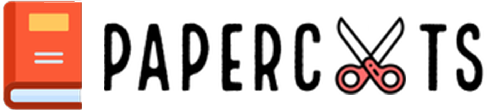
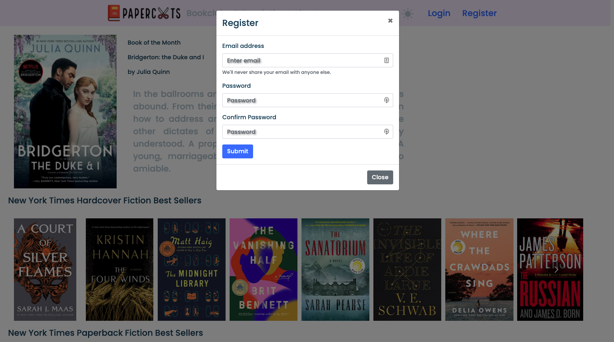
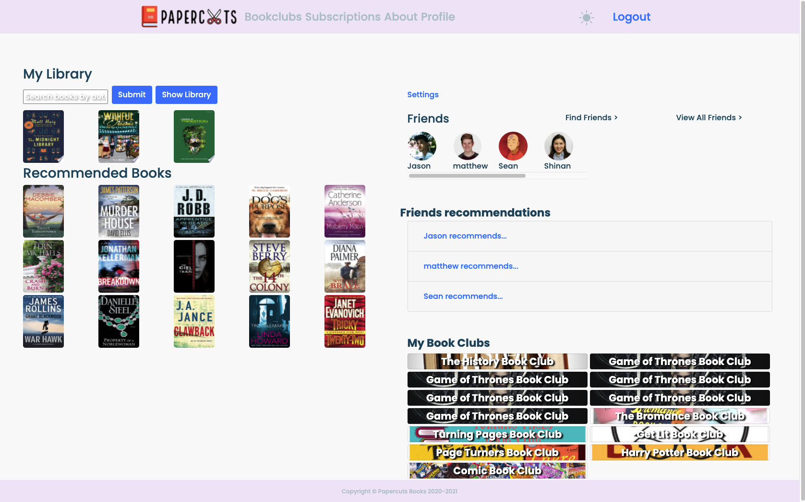
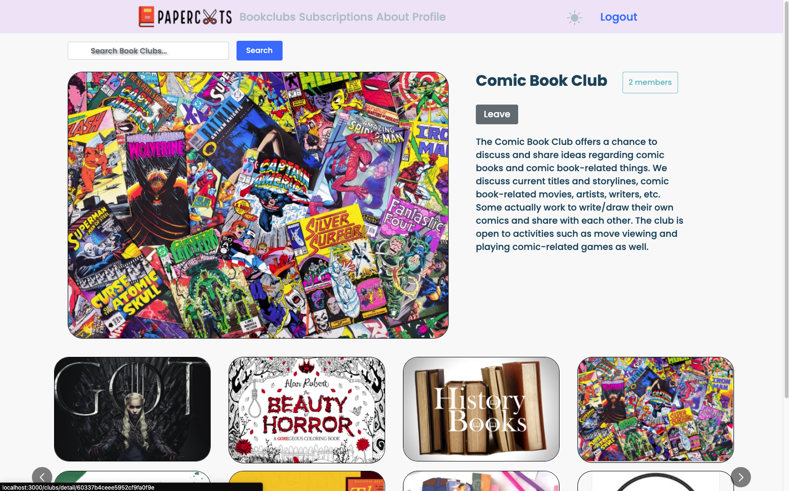
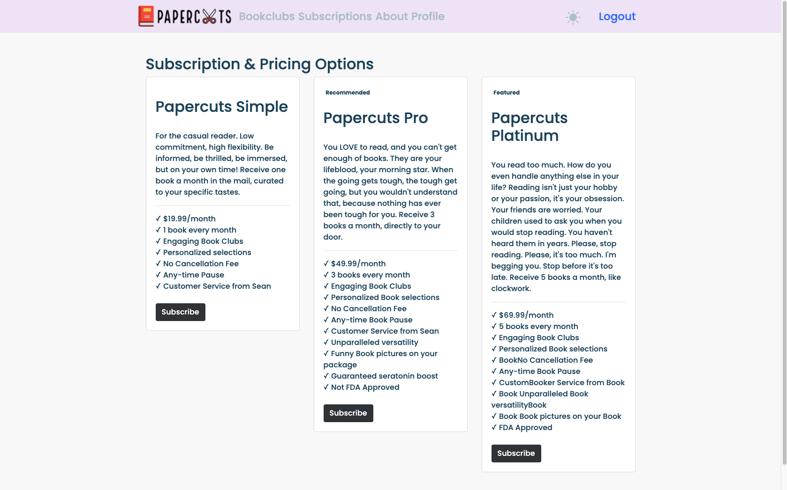

# Team Papercuts

[![Contributors][contributors-shield]][contributors-url]
[![Forks][forks-shield]][forks-url]
[![Stargazers][stars-shield]][stars-url]
[![Issues][issues-shield]][issues-url]
[![MIT License][license-shield]][license-url]
[![LinkedIn][linkedin-shield]][linkedin-url]

<!-- PROJECT LOGO -->
<br />
<p align="center">
  <a href="https://github.com/hratx-blue-ocean/Papercuts">
    
  </a>

  <h3 align="center">Papercuts Bookstore</h3>

  <p align="center">
    OUR MISSION: An application to connect your community through reading and sharing books. 
    <br />
    <a href="https://github.com/hratx-blue-ocean/Papercuts"><strong>Explore the docs »</strong></a>
    <br />
    <br />
    <a href="https://github.com/hratx-blue-ocean/Papercuts">View Demo</a>
    ·
    <a href="https://github.com/hratx-blue-ocean/Papercuts/issues">Report Bug</a>
    ·
    <a href="https://github.com/hratx-blue-ocean/Papercuts/issues">Request Feature</a>
  </p>
</p>

<!-- TABLE OF CONTENTS -->
<details open="open">
  <summary>Table of Contents</summary>
  <ol>
    <li>
      <a href="#about-the-project">About The Project</a>
      <ul>
        <li><a href="#built-with">Built With</a></li>
      </ul>
    </li>
    <li>
      <a href="#getting-started">Getting Started</a>
    </li>
    <li><a href="#usage">Usage</a></li>
    <li><a href="#roadmap">Roadmap</a></li>
    <li><a href="#contributing">Contributing</a></li>
    <li><a href="#license">License</a></li>
    <li><a href="#contact">Contact</a></li>
    <li><a href="#acknowledgements">Acknowledgements</a></li>
  </ol>
</details>

<!-- ABOUT THE PROJECT -->

## About The Project

Papercuts is a full-stack web application for buying, browsing, and commenting on the latest books. The user can register an account and maintain their own library of books, as well as make friends, leave recommendations, and start/join book clubs!


Key Features

- User authentication
- Displays a book of the month
- Explore trending books from New York Times 
- View purchased books in user library
- Search for new books in the user library
- Connect to friends
- Create Book Clubs and add Events

### Application login with proper authentication



- Click Register to create a new account with the site.
- Using sessions, you will only be asked to log in again once a week, for user convenience.
- If you lose your password, you may retrieve through the forgot password button.

### User Profile Page



- In your user profile, you may browse your library of purchased books or search for new ones.
- A gallery of recommended books will be available to you.
- You may also find new friends and see what they are currently recommending, as well as see the book clubs you are subscribed to.

### Book Clubs Page



- On the book clubs page, you may browse the available book clubs and click to join or leave them.
- Clicking on a club's image will take you to the detailed view, where the events, comments, and questionnaire are available.
- Only the owner will be able to create events, and only logged in users will be able to comment.

### Subscriptions Page



- On the subscriptions page, you may choose a plan to subscribe to. This will require you to have payment info saved in the settings page.

### Built With

This section should list any major frameworks that you built your project using. Leave any add-ons/plugins for the acknowledgements section. Here are a few examples.

<table>
  <tr>
    <td>Languages</td>
    <td>   </td>
  </tr>
  <tr>
    <td>Frameworks & Libraries</td>
    <td>  </td>
  </tr>
  <tr>
    <td>Hosting</td>
    <td> </td>
  </tr>
  <tr>
    <td>Databases</td>
    <td> </td>
  </tr>
  <tr>
    <td>Testing</td>
    <td></td>
  </tr>
</table>

<!-- GETTING STARTED -->

## Getting Started

This is an example of how you may give instructions on setting up your project locally.
To get a local copy up and running follow these simple example steps.

1. Create a free [Mongo Atlas](https://www.mongodb.com/cloud/atlas) account and obtain your key.
2. Obtain a free [New York Times](https://developer.nytimes.com/) API key.
3. Obtain a free [Google Books](https://console.cloud.google.com/projectselector/apis/credentials) API key.
4. Clone the repo
   ```sh
   git clone https://github.com/hratx-blue-ocean/Papercuts.git
   ```
5. Install NPM packages
   ```sh
   npm install
   ```
6. Enter your keys in the following form in a new file called `.env`
   ```sh
   MONGO_PASS=XXXXXXXX
   NYT_KEY=XXXXXXX
   GOOGLE_API_KEY=XXXXXXX
   ```
7. Start the server and access Papercuts locally at `http://localhost:3000`
   ```sh
   npm start
   ```
   
<!-- ROADMAP -->

## Roadmap

See the [open issues](https://github.com/hratx-blue-ocean/Papercuts/issues) for a list of proposed features (and known issues).

<!-- CONTRIBUTING -->

## Contributing

Contributions are what make the open source community such an amazing place to be learn, inspire, and create. Any contributions you make are **greatly appreciated**.

1. Fork the Project
2. Create your Feature Branch (`git checkout -b feature/AmazingFeature`)
3. Commit your Changes (`git commit -m 'Add some AmazingFeature'`)
4. Push to the Branch (`git push origin feature/AmazingFeature`)
5. Open a Pull Request

<!-- LICENSE -->

## License

Distributed under the MIT License. See `LICENSE` for more information.

<!-- CONTACT -->

## Contact

Project Link: [https://github.com/hratx-blue-ocean/Papercuts](https://github.com/hratx-blue-ocean/Papercuts)

<!-- ACKNOWLEDGEMENTS -->

## Acknowledgements

- [GitHub Emoji Cheat Sheet](https://www.webpagefx.com/tools/emoji-cheat-sheet)
- [Img Shields](https://shields.io)
- [Choose an Open Source License](https://choosealicense.com)

<!-- MARKDOWN LINKS & IMAGES -->
<!-- https://www.markdownguide.org/basic-syntax/#reference-style-links -->

[contributors-shield]: https://img.shields.io/github/contributors/othneildrew/Best-README-Template.svg?style=for-the-badge
[contributors-url]: https://github.com/hratx-blue-ocean/Papercuts/graphs/contributors
[forks-shield]: https://img.shields.io/github/forks/othneildrew/Best-README-Template.svg?style=for-the-badge
[forks-url]: https://github.com/hratx-blue-ocean/Papercuts
[stars-shield]: https://img.shields.io/github/stars/othneildrew/Best-README-Template.svg?style=for-the-badge
[stars-url]: https://github.com/hratx-blue-ocean/Papercuts/stargazers
[issues-shield]: https://img.shields.io/github/issues/othneildrew/Best-README-Template.svg?style=for-the-badge
[issues-url]: https://github.com/hratx-blue-ocean/Papercuts/issues
[license-shield]: https://img.shields.io/github/license/othneildrew/Best-README-Template.svg?style=for-the-badge
[license-url]: https://github.com/hratx-blue-ocean/Papercuts/blob/main/LICENSE
[linkedin-shield]: https://img.shields.io/badge/-LinkedIn-black.svg?style=for-the-badge&logo=linkedin&colorB=555
[linkedin-url]: https://www.linkedin.com/school/hack-reactor/mycompany/
[product-screenshot]: Docs/readMeImage/screenshot.png
